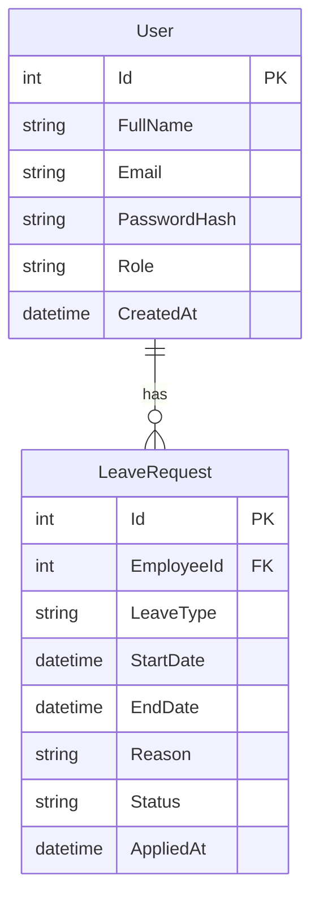

```mermaid
erDiagram
    User {
        int Id PK
        string FullName
        string Email
        string PasswordHash
        string Role
        datetime CreatedAt
    }

    LeaveRequest {
        int Id PK
        int EmployeeId FK
        string LeaveType
        datetime StartDate
        datetime EndDate
        string Reason
        string Status
        datetime AppliedAt
    }

    User ||--o{ LeaveRequest : "has"
```
